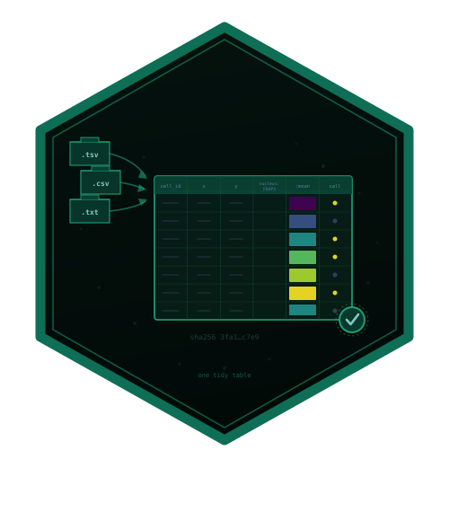

---
output:
  github_document:
    toc: true
---

# cellspecR 

<!-- badges: start -->
[](https://lifecycle.r-lib.org/articles/stages.html#experimental)
[](https://opensource.org/licenses/MIT)
<!-- badges: end -->

`cellspecR` defines the `cellspec` 1.0 table contract for segmented cells from
multiplexed tissue images. It reads tool exports, validates structure and
semantics, and writes an integrity checked directory for downstream analysis.

> **Status: development version.** The specification, object model,
> validation, canonical I/O, signal policy, combination helpers, specialized
> readers, interoperability, plots and the Shiny app are included in this
> development build. Release hardening and external fixture cross-checks
> remain on the checklist.

## Install

```r
# install.packages("pak")
pak::pak("CTTIR/cellspecR")
```

## Quick start

```{r setup, include=FALSE}
knitr::opts_chunk$set(collapse = TRUE, comment = "#>")
if (requireNamespace("cellspecR", quietly = TRUE)) {
  library(cellspecR)
} else if (requireNamespace("devtools", quietly = TRUE)) {
  devtools::load_all(quiet = TRUE)
}
```

```{r quick-start}
x <- cs_example()
print(x)
cs_validate(x)

policy <- cs_signal_policy(
  marker = c("CD3e", "FOXP3"),
  compartment = c("cell", "nucleus"),
  statistic = "mean"
)
signal <- cs_signal_matrix(x, policy)
dim(signal$signal)

destination <- file.path(tempdir(), "cellspec-example")
cs_write(x, destination, overwrite = TRUE)
cs_verify(destination)
y <- cs_read_cellspec(destination)
identical(cs_cells(x), cs_cells(y))
```

## What the package provides

* `cs_read()` and `cs_detect_format()` for tool exports, plus
  `cs_column_map()` for explicit generic tables.
* `cs_new()`, accessors, subsetting and compact print and summary methods.
* `cs_validate()` and `cs_feature_support()` for structural and signal quality
  checks.
* Parquet or exact text storage with a JSON sidecar, SHA-256 manifest and
  atomic staging through `cs_write()` and `cs_read_cellspec()`.
* Explicit signal policies, marker maps, object binding and tiled ownership.
* Optional conversion to `SpatialExperiment` and AnnData, quality-control
  plots and a local Shiny review app.

The package does not segment images, normalize signals, gate cells or perform
spatial statistics. It keeps the table contract and provenance at the boundary
between those tools.

## Data and reproducibility

The bundled export in `inst/extdata/` is synthetic and contains no patient data.
Reader fixtures record their generator, header grammar and SHA-256 in
`tests/testthat/fixtures/README.md`. Examples do not access the network.

## Contributing and license

Contributions follow the [CTTIR contributing guide](https://github.com/CTTIR/.github/blob/main/CONTRIBUTING.md).
The package is released under the MIT license.
